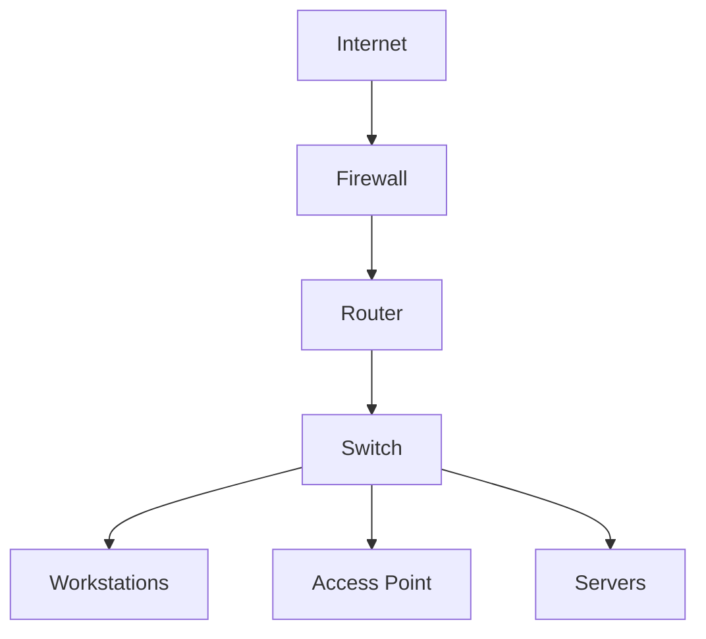

#  Small Office Network Topology

##  **Project Description**

This project outlines the design and implementation of a **basic network topology for a small office setup**. The network is designed to ensure **scalability, redundancy, and security** while maintaining simplicity and manageability.

##  **Objectives**

- **Establish a reliable network infrastructure** for a small office.
- **Ensure secure and efficient connectivity** for all office devices.
- **Incorporate redundancy** to reduce downtime.
- **Design a scalable network** that can grow with the office needs.

##  **Network Components**

1. **Internet Connection** 
2. **Firewall** 
3. **Router** 
4. **Switch** 
5. **Access Points (APs)** 
6. **Servers** 
7. **Workstations** 
8. **Printers & Peripherals** 

##  **Network Design**

### **1. Internet and Perimeter Security**
- **ISP Connection**: Provides internet access.
- **Firewall**: Protects the network from external threats.
- **Router**: Connects the internal network to the internet.

### **2. Core Network**
- **Switch**: Central device connecting all wired devices.
- **Servers**: Hosts internal services and applications.
- **Workstations**: Office computers for employees.
- **Access Points**: Provides wireless connectivity.

### **3. Network Segmentation**
- **Office Network VLAN**: For general employee access.
- **Guest Network VLAN**: Isolated network for visitors.
- **Server Network VLAN**: Isolated for server security.
- **VPN for Remote Access**: Secure connection for remote workers.

### **4. Redundancy**
- **Redundant Switch**: Backup switch for failover.
- **Dual Internet Connections**: Secondary internet connection for reliability.
- **UPS for Critical Devices**: Uninterruptible power supply for essential network components.

### **5. Security Measures**
- **Configure Firewall**: Set up strict rules to block unauthorized access.
- **Access Control Lists (ACLs)**: Control traffic flow on switches and routers.
- **Intrusion Detection/Prevention Systems (IDS/IPS)**: Monitor and prevent suspicious activities.
- **Regular Updates and Patching**: Keep all devices and servers updated.
- **Strong Password Policies**: Implement robust password requirements.
- **Network Monitoring**: Tools to monitor performance and detect anomalies.

## 📊 **Diagram**

##  **Topology Process**

1. **Identify Requirements**: Determine the specific needs of the office.
2. **Select Topology**: Choose a star topology for simplicity and scalability.
3. **Determine Components**: List all necessary hardware and software.
4. **Design Layout**: Plan the physical and logical layout of the network.
5. **Implement Segmentation**: Use VLANs and VPNs to segment and secure the network.
6. **Plan Redundancy**: Ensure there are backups and failover mechanisms.
7. **Establish Security**: Implement measures to protect the network from threats.
8. **Create Diagram**: Visualize the network layout.
9. **Review and Finalize**: Ensure the design meets all requirements and best practices.
10. **Implement Design**: Set up the network as planned.
11. **Test and Validate**: Ensure everything works as expected.
12. **Ongoing Maintenance**: Regularly monitor and maintain the network.

